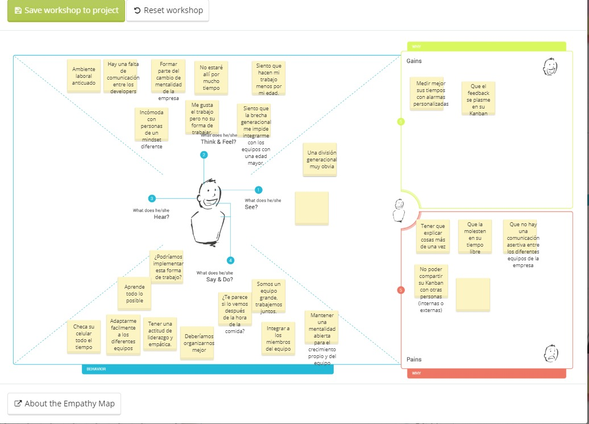
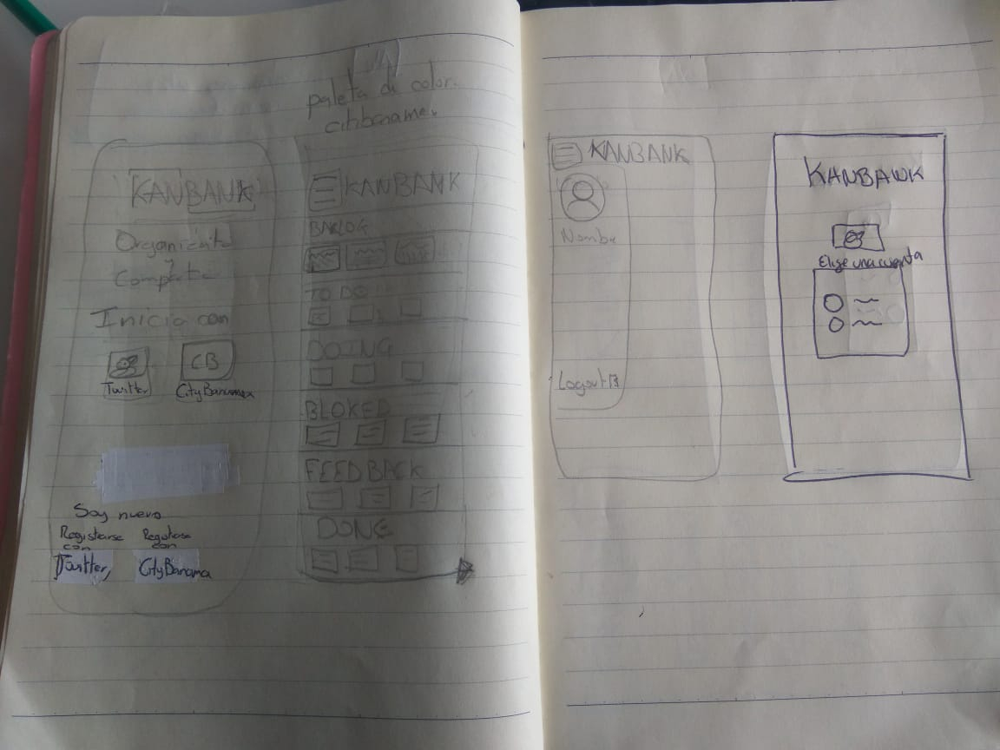
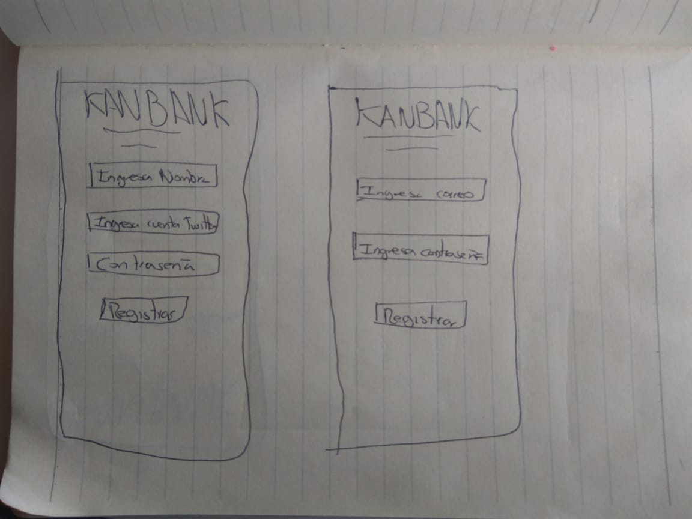
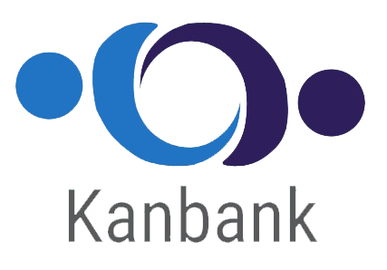

## Introducción al problema

Ale, es una chica bastante activa que trabaja en un Banco el cual se encuentra en un proceso de transformación en cuanto a su forma de trabajo. 
Es una apasionada en lo que hace, trabaja en el área de UX, en el desarrollo de las nuevas funcionalidades mobile, y la mayoría de las veces cree que la comunicación con su equipo, especialmente la comunicación con los developers resulta complicada y tediosa, ya que el lenguaje que ellos usan resulta muy técnico y engorroso. 
Así mismo la brecha generacional se convierte en un gran problema para la implementación del marco de trabajo Agile, con el cual Ale se encuentra apasionada y  comprometida para hacerlo conocer dentro de toda la empresa en la que trabaja.
Cree que la implementación de esta forma de trabajo en las demás áreas de su empresa puede irse haciendo poco a poco.

Por eso mismo, decidimos crear una aplicación que emula la interacción con un tablero Kanban, esta contará con las siguientes cualidades:

* Fácil e intuitiva de utilizar
* Personalizable
* Ingreso a ella con métodos diferentes además de la cuenta de CitiBanamex
* Interacción entre los usuarios
* Habilidad de compartir su tablero y seguir tableros disntintos.

## User persona

Piensa:
* Ambiente laboral anticuado
* Hay una falta de comunicación entre los developers
* Formar parte del cambio de mentalidad de la empresa
* No estaré allí por mucho tiempo

Dice:
* ¿Podríamos implementar esta forma de trabajo?
* Deberíamos organizarnos mejor
* Somos un equipo grande, trabajemos juntos.
* ¿Te parece si lo vemos después de la hora de la comida?

Hace:
* Aprende todo lo posible
* Checa su celular todo el tiempo
* Adaptarme facilmente a los diferentes equipos
* Integrar a los miembros del equipo
* Tener una actitud de liderazgo y empatica.
* Mantener una mentalidad abierta para el crecimiento propio y del equipo

Siente:

* Incómoda con personas de un mindset difrente
* Me gusta el trabajo pero no su forma de trabajar.
* Siento que la brecha generacional me impide integrarme con los equipos con una edad mayor.
* Siento que hacen mi trabajo menos por mi edad.

### Emphaty map

## Journey Map

## Wireframe

## Prototipo
En la siguiente liga se podrá visualizar el prototipo: https://marvelapp.com/33i4j7i
##  User testing

Al realizar el user testing con el primer prototipo realizado se recibió el siguiente feedback:

* A nuestro usuario le gustaría poder agregar a amigos
* La posibilidad de seguir tableros diferentes
* La posibilidad de compartir su tablero

## Logotipo y nombre de la APP
### KANBANK

 
 

### Significado

Se decidió que el nombre de la aplicación fuera uno descriptivo y sencillo de memorizar, KANBANK hace referencia al tablero Kanban, así como a la empresa, un corporativo bancario, sin embargo, no es solamente eso, sino que también hace referencia al banco de tableros kanban que nuestra aplicación contiene.
Las dos personas abranzándose, representaría la comunicación asertiva, la misma que se pretende fomentar entre los usuarios y trabajadores del corporativo.

### Paleta de colores 

#3319a0
#1e7b9a

En cuanto a la paleta de colores selccionada para la aplicación se implementó una gama de azules, ya que esta, según la psicología del color, inspira confianza, la misma que queremos ejercer en nuestros usuarios. También representa frescura, e inovación.

